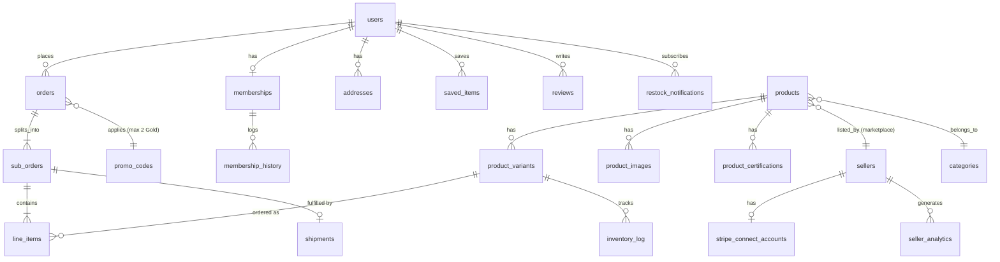
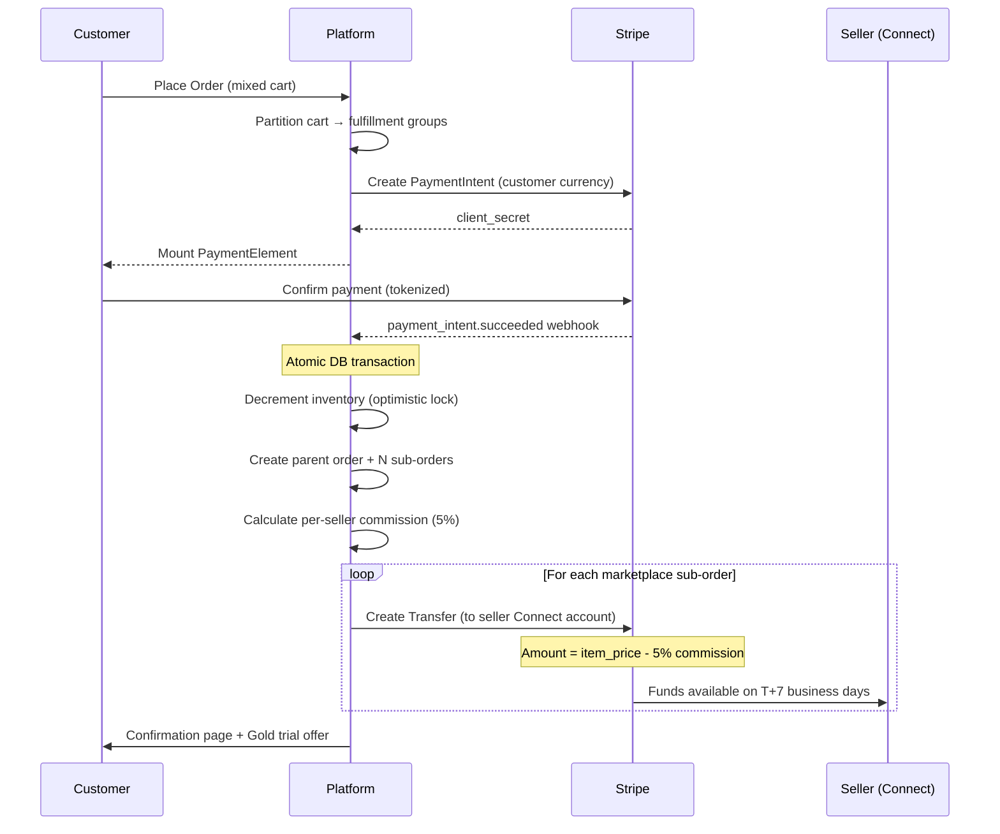
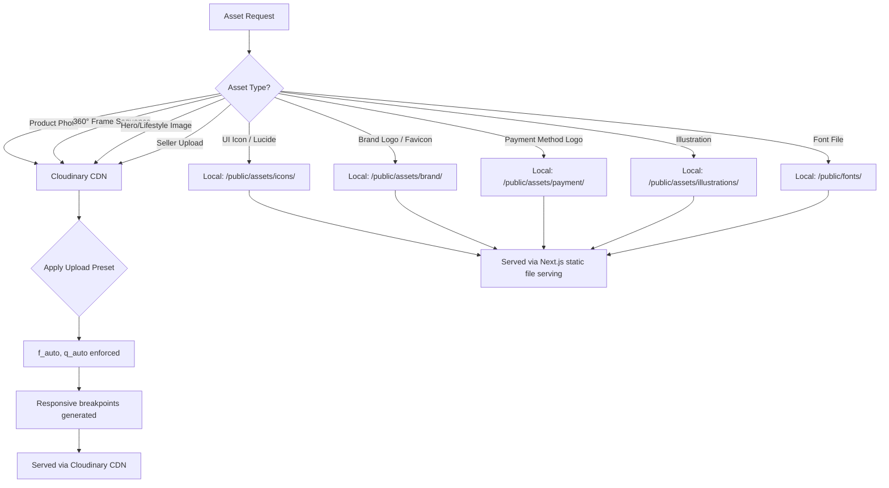
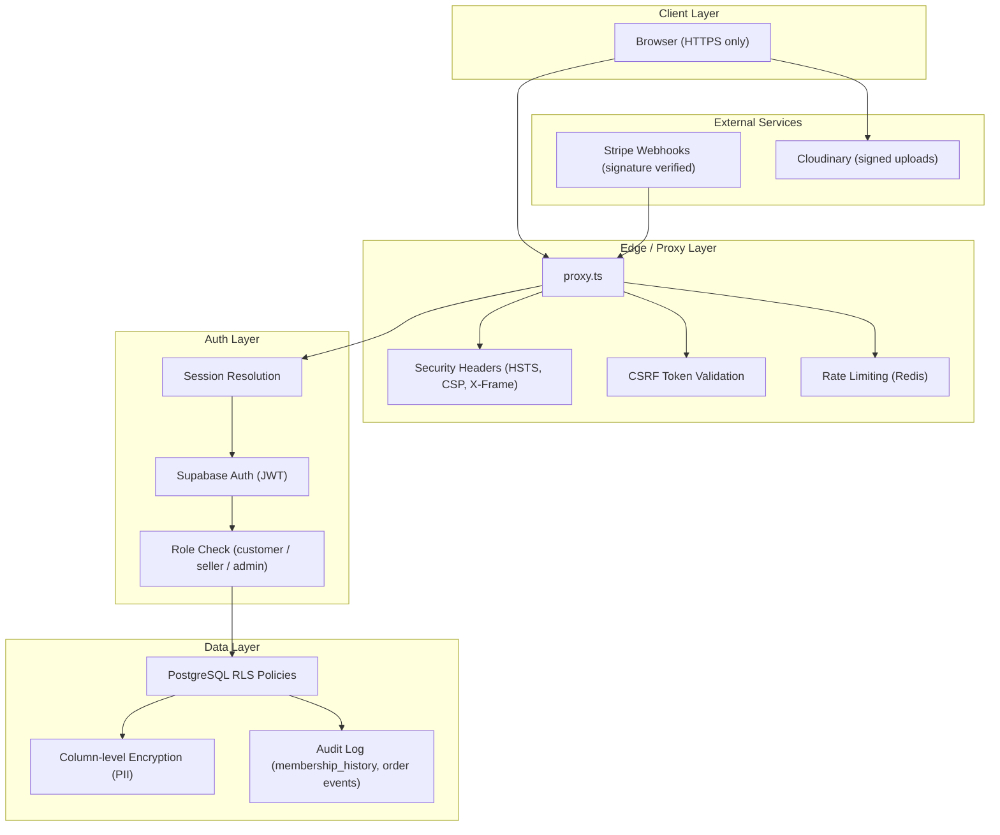

# Architecture: Home & Kitchen Platform

> **Immutable Contract** — This document is the single source of technical truth for all coding agents.
> **Brand DNA:** Organic Modernist — Restorative · Safe · Aspirational · Minimalist
> **Companion:** [PRD.md](file:///c:/Users/yugam/Desktop/Ecom%202/docs/PRD.md) · [design-system.md](file:///c:/Users/yugam/Desktop/Ecom%202/docs/design-system.md)

---

## Table of Contents

1. [Preamble & Version Lock](#1-preamble--version-lock)
2. [Directory Structure](#2-directory-structure)
3. [Database Schema & ERD](#3-database-schema--erd)
4. [Routing & Proxy Layer](#4-routing--proxy-layer)
5. [State & Realtime](#5-state--realtime)
6. [Integration Map](#6-integration-map)
7. [Hybrid Asset Strategy](#7-hybrid-asset-strategy)
8. [Performance & Caching](#8-performance--caching)
9. [Security & Compliance](#9-security--compliance)
10. [Dependency Enforcement](#10-dependency-enforcement)
11. [Feature Implementation Index](#11-feature-implementation-index)

---

## 1. Preamble & Version Lock

### 1.1 Framework & Runtime Lock

| Dependency | Version | Rationale |
|---|---|---|
| **Next.js** | `16.1.6` (Active LTS) | **Non-negotiable.** Mitigates CVE-2026-23864 in the RSC data layer. All agents must pin this exact version. |
| **React** | `19.2.x` | Server Components + React Compiler optimization. Bundled with Next.js 16.1.6. |
| **Node.js** | `20.x` (LTS) | Runtime for `proxy.ts` (Stable Node.js runtime) and all server-side logic. |
| **Turbopack** | Stable (bundled) | Default bundler for Next.js 16. Replaces Webpack. No Webpack config files permitted. |
| **Tailwind CSS** | `4.0.x` | CSS-variable-first configuration. No legacy `tailwind.config.js` — use `@theme` in CSS. |
| **TypeScript** | `5.7.x` | Strict mode. All files `.ts`/`.tsx`. No `.js` in `src/`. |

> [!CAUTION]
> **CVE-2026-23864 Mitigation:** Next.js versions prior to 16.1.4 contain a critical vulnerability in the React Server Component data serialization layer that allows prototype pollution via crafted RSC payloads. Upgrading beyond 16.1.6 is permitted only after verifying no breaking changes to the `proxy.ts` API. Downgrading is **never** permitted.

### 1.2 Core Stack

| Layer | Technology | Role |
|---|---|---|
| Frontend | Next.js 16 + React 19.2 RSC | SSR/SSG, React Server Components, App Router |
| UI Kit | shadcn/ui (Radix primitives + Tailwind 4.0) | Accessible, composable components |
| Backend/DB | Supabase (PostgreSQL 15) | Auth, Database, Realtime subscriptions, Storage |
| Search | Typesense | Sub-50ms typo-tolerant search (DISC-001→013) |
| Payments | Stripe + Stripe Connect | Checkout, multi-currency, marketplace payouts |
| Media CDN | Cloudinary (product media only) | 360° assets, hero images, product photography |
| Local Assets | `/public/assets/` | Icons, UI SVGs, brand marks — zero Cloudinary credits |
| Email | Resend | Transactional emails (order confirmation, SLA breach, membership) |
| Hosting | Vercel | Edge deployment, serverless functions, preview deployments |

### 1.3 Next.js 16 Pattern Rules

| Pattern | Usage | Rule |
|---|---|---|
| `proxy.ts` | Routing, auth guards, split-shipping logic, Stripe session | Stable Node.js runtime. All middleware-like logic lives here. **No `middleware.ts`**. |
| `use cache` | Explicit caching control | Replaces legacy `fetch`-level caching. Applied per-component or per-function. |
| React Server Components | Default for all components | Client components only when interactivity required (`"use client"` directive). |
| React Compiler | Automatic memoization | No manual `useMemo`/`useCallback` unless profiler proves necessity. |
| `layout.tsx` | Shared UI shells | Navbar, Footer, providers. Nested per route group. |
| `page.tsx` | Route entry points | Server Components by default. |
| `loading.tsx` | Suspense boundaries | Skeleton UI matching design-system.md §5.2 (skeleton pulse animation). |
| `error.tsx` | Error boundaries | Per-route error handling with recovery. Uses design-system.md §4.17 error states. |

---

## 2. Directory Structure

```
src/
├── proxy.ts                          # Stable Node.js runtime — routing, auth guards, split-ship logic
├── app/
│   ├── layout.tsx                    # Root layout: Navbar + Footer + Providers
│   ├── page.tsx                      # Homepage (§3.1 design-system)
│   ├── loading.tsx                   # Root loading skeleton
│   ├── error.tsx                     # Root error boundary
│   ├── (shop)/
│   │   ├── products/
│   │   │   ├── page.tsx              # PLP — Product Listing Page (§3.2 design-system)
│   │   │   └── [slug]/
│   │   │       └── page.tsx          # PDP — Product Detail Page (§3.3 design-system)
│   │   ├── categories/
│   │   │   └── [category]/
│   │   │       └── page.tsx          # Category-filtered PLP
│   │   └── search/
│   │       └── page.tsx              # Search results page (DISC-005→013)
│   ├── (checkout)/
│   │   ├── cart/
│   │   │   └── page.tsx              # Full cart page
│   │   ├── checkout/
│   │   │   └── page.tsx              # Single-page accordion checkout (§3.4 design-system)
│   │   └── confirmation/
│   │       └── page.tsx              # Order confirmation + Gold trial offer (CHK-011→015)
│   ├── (account)/
│   │   ├── layout.tsx                # Account shell: sidebar + content area (§3.6 design-system)
│   │   ├── profile/page.tsx
│   │   ├── orders/
│   │   │   ├── page.tsx              # Order list
│   │   │   └── [orderId]/page.tsx    # Order detail + tracking
│   │   ├── saved/page.tsx            # Wishlist (§3.6 Saved Items)
│   │   ├── membership/page.tsx       # Membership management (§3.6 Membership)
│   │   ├── addresses/page.tsx
│   │   ├── returns/page.tsx          # Returns & Refunds (§3.6)
│   │   ├── help/page.tsx             # Help & Support (§3.6)
│   │   └── settings/page.tsx
│   ├── (seller)/
│   │   ├── layout.tsx                # Seller dashboard shell (max 5 nav items — PRD §2.4)
│   │   ├── dashboard/page.tsx
│   │   ├── products/page.tsx         # Listing management + CSV bulk upload
│   │   ├── orders/page.tsx           # Seller order management
│   │   ├── analytics/page.tsx        # Impressions, CTR, conversion (PRD §2.4 Growth)
│   │   └── earnings/page.tsx         # Commission breakdown, payout schedule
│   ├── (auth)/
│   │   ├── login/page.tsx
│   │   ├── register/page.tsx
│   │   └── forgot-password/page.tsx
│   ├── membership/page.tsx           # Membership/Pricing page (§3.5 design-system)
│   ├── about/page.tsx
│   ├── contact/page.tsx
│   ├── privacy/page.tsx              # Privacy policy (GDPR/CCPA — PRD §5.4)
│   └── api/
│       ├── search/suggest/route.ts   # Autocomplete endpoint (DISC-001→004)
│       ├── cart/items/route.ts       # Cart CRUD
│       ├── checkout/
│       │   └── create-intent/route.ts # Stripe PaymentIntent (CHK-002)
│       ├── orders/route.ts           # Order creation with idempotency (CHK-005)
│       ├── inventory/[productId]/route.ts  # Inventory polling fallback (PDP-004)
│       ├── memberships/trial/route.ts      # 1-Click Gold trial (CHK-012)
│       ├── notifications/restock/route.ts  # Restock notification signup (PDP-003)
│       ├── recommendations/trending/route.ts # Gold add-on bundles (GOLD-006)
│       ├── users/[id]/payment-methods/route.ts # Saved payment methods (CHK-003)
│       ├── privacy/
│       │   ├── erasure/route.ts      # GDPR right-to-erasure (PRD §5.4)
│       │   └── export/route.ts       # GDPR data export (PRD §5.4)
│       ├── webhooks/
│       │   ├── stripe/route.ts       # Stripe webhook handler
│       │   └── inventory/route.ts    # Dropship partner inventory webhooks
│       └── exchange-rates/route.ts   # Currency rate refresh (INTL-003)
├── components/
│   ├── wellness-ui/                  # shadcn/ui + custom components per design-system.md
│   │   ├── button.tsx                # §4.1 — Pill buttons (all variants/sizes)
│   │   ├── input.tsx                 # §4.2 — Text, search-pill, select, range slider, checkbox
│   │   ├── badge.tsx                 # §4.3 — All badge variants
│   │   ├── product-card.tsx          # §4.4 — PLP/carousel product card
│   │   ├── star-rating.tsx           # §4.5 — Star rating display
│   │   ├── accordion.tsx             # §4.6 — FAQ accordion
│   │   ├── testimonial-card.tsx      # §4.7 — Testimonial carousel card
│   │   ├── toast.tsx                 # §4.8 — Toast notifications
│   │   ├── autocomplete.tsx          # §4.9 — Search autocomplete dropdown
│   │   ├── typo-correction.tsx       # §4.10 — "Showing results for X"
│   │   ├── comparison-tray.tsx       # §4.11 — Compare up to 4 products
│   │   ├── mini-cart.tsx             # §4.12 — Slide-in cart panel
│   │   ├── notify-me.tsx             # §4.13 — OOS restock notification
│   │   ├── toggle-switch.tsx         # §4.14 — Subscribe & Save toggle
│   │   ├── quantity-stepper.tsx      # §4.15 — Cart quantity controls
│   │   ├── gold-trial-card.tsx       # §4.16 — Post-checkout Gold trial offer
│   │   ├── empty-state.tsx           # §4.17 — Empty & error states
│   │   ├── navbar.tsx                # §2.4 — Fixed navbar + mega-nav
│   │   ├── footer.tsx                # §2.5 — Dark footer
│   │   ├── checkout-accordion.tsx    # §3.4 — Checkout step accordion
│   │   ├── image-viewer-360.tsx      # PDP-005→008 — 360° product viewer
│   │   ├── membership-card.tsx       # §3.5 — Pricing tier cards
│   │   ├── split-shipping-notice.tsx # §3.4 — Split-shipping disclosure
│   │   └── membership-banner.tsx     # §3.4 — Checkout upgrade banner
│   ├── external/                     # Third-party animations (Framer Motion, GSAP)
│   │   ├── .eslintrc.json            # Isolated lint rules — LCP guard (< 1.2s)
│   │   ├── hero-slider.tsx           # Hero auto-advance slider
│   │   ├── carousel.tsx              # Trending/related product carousel
│   │   └── scroll-reveal.tsx         # Section fade-in on scroll
│   └── providers/
│       ├── supabase-provider.tsx      # Supabase client context
│       ├── cart-provider.tsx          # Cart state (LocalStorage + server sync)
│       ├── currency-provider.tsx      # Multi-currency context (INTL-001→006)
│       └── realtime-provider.tsx      # WebSocket subscription manager
├── lib/
│   ├── database/
│   │   ├── supabase-client.ts        # Server + client Supabase instances
│   │   ├── supabase-admin.ts         # Service-role client (server-only)
│   │   ├── types.ts                  # Generated TypeScript types from Supabase schema
│   │   └── queries/
│   │       ├── products.ts           # Product CRUD + variant matrix queries
│   │       ├── orders.ts             # Order + sub-order lifecycle
│   │       ├── inventory.ts          # Stock check, decrement (optimistic lock)
│   │       ├── memberships.ts        # Tier management, trial, upgrade/downgrade
│   │       ├── sellers.ts            # Seller onboarding, commission, payout
│   │       └── privacy.ts            # GDPR erasure, export, CCPA opt-out
│   ├── stripe/
│   │   ├── client.ts                 # Stripe SDK initialization
│   │   ├── checkout.ts               # PaymentIntent lifecycle (CHK-001→005)
│   │   ├── connect.ts                # Stripe Connect — seller payouts (MKT-003)
│   │   ├── subscriptions.ts          # Gold membership billing (GOLD-001→008)
│   │   └── webhooks.ts               # Webhook signature verification + handlers
│   ├── typesense/
│   │   ├── client.ts                 # Typesense SDK initialization
│   │   ├── indexer.ts                # Product index sync (on DB change)
│   │   └── search.ts                 # Search + autocomplete + typo tolerance
│   ├── cloudinary/
│   │   ├── config.ts                 # Upload preset with f_auto,q_auto enforcement
│   │   ├── transform.ts             # URL builder with responsive breakpoints
│   │   └── upload.ts                 # Server-side upload for seller product images
│   ├── currency/
│   │   ├── rates.ts                  # Exchange rate fetcher (15-min refresh — INTL-003)
│   │   ├── format.ts                 # Intl.NumberFormat wrappers (INTL-006)
│   │   └── lock.ts                   # Checkout rate locking logic (INTL-004)
│   ├── membership/
│   │   ├── tier-engine.ts            # Tier benefit resolution
│   │   └── discount-stacking.ts      # STK-001→007 stacking rules engine
│   ├── fulfillment/
│   │   ├── router.ts                 # Fulfillment source routing (INV-001→004)
│   │   ├── split-order.ts            # Parent + N child sub-order creation (INV-003)
│   │   └── sla-monitor.ts            # Dropship SLA timer + escalation (INV-005→008)
│   ├── email/
│   │   └── resend.ts                 # Transactional email triggers (Resend SDK)
│   └── utils/
│       ├── idempotency.ts            # UUID v4 idempotency key management (CHK-005)
│       └── validation.ts             # Zod schemas for API input validation
├── hooks/
│   ├── use-cart.ts                   # Cart mutations + LocalStorage sync (CHK-006→010)
│   ├── use-inventory.ts             # WebSocket inventory subscription (PDP-001→004)
│   ├── use-currency.ts              # Currency detection + override (INTL-001→002)
│   └── use-search.ts                # Debounced autocomplete (DISC-001→004)
├── styles/
│   └── globals.css                   # Tailwind 4.0 @theme + design tokens + container classes
└── types/
    └── index.ts                      # Shared TypeScript types/interfaces

public/
├── assets/
│   ├── icons/                        # Lucide icon SVGs — served locally (zero Cloudinary credits)
│   ├── brand/                        # Logo, favicon, OG images — served locally
│   ├── payment/                      # Visa, MC, PayPal, GPay, ApplePay SVG icons
│   └── illustrations/               # Empty states, onboarding illustrations
├── fonts/
│   ├── satoshi/                      # Self-hosted Satoshi font files (@font-face)
│   └── geist-mono/                   # Self-hosted Geist Mono font files
└── robots.txt
```

### 2.3 Route Map
| Route | Access | Purpose |
|---|---|---|
| `(account)/my-orders` | Auth | User order history (was /orders) |
| `(account)/my-membership` | Auth | Membership mgmt (was /membership) |
| `(seller)/seller-orders` | Seller | Seller order fulfillment (was /orders) |
| `(seller)/seller-products` | Seller | Listing management (was /products) |


> [!IMPORTANT]
> **Hybrid Asset Strategy:** All UI icons (`/public/assets/icons/`), brand marks (`/public/assets/brand/`), payment logos, and illustrations are served locally from `/public/assets/` to preserve Cloudinary transformation credits exclusively for product media (hero images, PDP photography, 360° frame sequences). Cloudinary is **never** used for UI assets.

---

## 3. Database Schema & ERD

### 3.1 Entity Relationship Diagram



### 3.2 Core Tables

#### `users`

```sql
CREATE TABLE users (
  id              UUID PRIMARY KEY DEFAULT gen_random_uuid(),
  email           TEXT UNIQUE NOT NULL,
  full_name       TEXT,
  phone           TEXT,
  avatar_url      TEXT,
  membership_tier TEXT NOT NULL DEFAULT 'free' CHECK (membership_tier IN ('free', 'gold')),
  stripe_customer_id TEXT UNIQUE,
  preferred_currency TEXT NOT NULL DEFAULT 'USD',
  locale          TEXT NOT NULL DEFAULT 'en-US',
  ccpa_opt_out    BOOLEAN NOT NULL DEFAULT FALSE,
  tos_accepted_version TEXT,
  created_at      TIMESTAMPTZ NOT NULL DEFAULT now(),
  updated_at      TIMESTAMPTZ NOT NULL DEFAULT now()
);

-- Index for membership-aware queries (GOLD-003, GOLD-007, GOLD-008)
CREATE INDEX idx_users_membership ON users(membership_tier);
```

#### `memberships`

```sql
CREATE TABLE memberships (
  id              UUID PRIMARY KEY DEFAULT gen_random_uuid(),
  user_id         UUID NOT NULL REFERENCES users(id) ON DELETE CASCADE,
  tier            TEXT NOT NULL CHECK (tier IN ('free', 'gold')),
  status          TEXT NOT NULL CHECK (status IN ('active', 'trial', 'past_due', 'canceled')),
  trial_start     TIMESTAMPTZ,
  trial_end       TIMESTAMPTZ,
  current_period_start TIMESTAMPTZ,
  current_period_end   TIMESTAMPTZ,
  stripe_subscription_id TEXT UNIQUE,
  cancel_at_period_end   BOOLEAN NOT NULL DEFAULT FALSE,
  payment_retry_count    INT NOT NULL DEFAULT 0,
  created_at      TIMESTAMPTZ NOT NULL DEFAULT now(),
  updated_at      TIMESTAMPTZ NOT NULL DEFAULT now(),
  UNIQUE(user_id)
);

-- PRD CHK-014: Prevent duplicate trials
CREATE TABLE membership_history (
  id          UUID PRIMARY KEY DEFAULT gen_random_uuid(),
  user_id     UUID NOT NULL REFERENCES users(id) ON DELETE CASCADE,
  action      TEXT NOT NULL CHECK (action IN ('trial_started', 'activated', 'renewed', 'canceled', 'downgraded', 'payment_failed')),
  tier        TEXT NOT NULL,
  metadata    JSONB DEFAULT '{}',
  created_at  TIMESTAMPTZ NOT NULL DEFAULT now()
);
CREATE INDEX idx_membership_history_user ON membership_history(user_id, action);
```

#### `categories`

```sql
CREATE TABLE categories (
  id          UUID PRIMARY KEY DEFAULT gen_random_uuid(),
  name        TEXT NOT NULL,
  slug        TEXT UNIQUE NOT NULL,
  parent_id   UUID REFERENCES categories(id),
  image_url   TEXT,
  description TEXT,
  sort_order  INT DEFAULT 0,
  created_at  TIMESTAMPTZ NOT NULL DEFAULT now(),
  updated_at  TIMESTAMPTZ NOT NULL DEFAULT now()
);
```

#### `addresses`

```sql
CREATE TABLE addresses (
  id          UUID PRIMARY KEY DEFAULT gen_random_uuid(),
  user_id     UUID NOT NULL REFERENCES users(id) ON DELETE CASCADE,
  type        TEXT CHECK (type IN ('shipping', 'billing')),
  is_default  BOOLEAN DEFAULT FALSE,
  name        TEXT NOT NULL,
  line1       TEXT NOT NULL,
  line2       TEXT,
  city        TEXT NOT NULL,
  state       TEXT NOT NULL,
  postal_code TEXT NOT NULL,
  country     TEXT NOT NULL,
  phone       TEXT,
  created_at  TIMESTAMPTZ NOT NULL DEFAULT now(),
  updated_at  TIMESTAMPTZ NOT NULL DEFAULT now()
);
```

#### `saved_items`

```sql
CREATE TABLE saved_items (
  id          UUID PRIMARY KEY DEFAULT gen_random_uuid(),
  user_id     UUID REFERENCES users(id) ON DELETE CASCADE,
  product_id  UUID REFERENCES products(id) ON DELETE CASCADE,
  created_at  TIMESTAMPTZ DEFAULT now(),
  UNIQUE(user_id, product_id)
);
```

#### `reviews`

```sql
CREATE TABLE reviews (
  id          UUID PRIMARY KEY DEFAULT gen_random_uuid(),
  user_id     UUID REFERENCES users(id) ON DELETE SET NULL,
  product_id  UUID REFERENCES products(id) ON DELETE CASCADE,
  rating      INT CHECK (rating BETWEEN 1 AND 5),
  title       TEXT,
  body        TEXT,
  is_verified_purchase BOOLEAN DEFAULT FALSE,
  helpful_votes INT DEFAULT 0,
  created_at  TIMESTAMPTZ DEFAULT now(),
  updated_at  TIMESTAMPTZ DEFAULT now()
);
```


#### `products`

```sql
CREATE TABLE products (
  id              UUID PRIMARY KEY DEFAULT gen_random_uuid(),
  seller_id       UUID REFERENCES sellers(id),          -- NULL = DTC (platform-owned)
  category_id     UUID NOT NULL REFERENCES categories(id),
  name            TEXT NOT NULL,
  slug            TEXT UNIQUE NOT NULL,
  description     TEXT,
  short_description TEXT,
  base_price_usd  NUMERIC(10,2) NOT NULL CHECK (base_price_usd >= 0),
  gold_price_usd  NUMERIC(10,2),                        -- GOLD-008: Exclusive pricing
  pricing_tag     TEXT CHECK (pricing_tag IN ('standard', 'clearance', 'gold_exclusive')),
  inventory_source TEXT NOT NULL CHECK (inventory_source IN ('warehouse', 'seller_fulfilled', 'dropship')),
  visible_to      TEXT NOT NULL DEFAULT 'all' CHECK (visible_to IN ('all', 'gold')),  -- GOLD-007: Early access gating
  visibility_unlock_at TIMESTAMPTZ,                     -- Auto-unlock after 48h
  is_self_sanitizing BOOLEAN NOT NULL DEFAULT FALSE,    -- USP metadata
  is_modular       BOOLEAN NOT NULL DEFAULT FALSE,      -- USP metadata
  certifications   TEXT[] DEFAULT '{}',                  -- Array: ['organic','bpa_free','fair_trade','usda']
  material         TEXT,
  dimensions       JSONB,                                -- {"width": 10, "height": 5, "depth": 3, "unit": "inches"}
  weight_grams     INT,
  features         JSONB DEFAULT '[]',                   -- Feature bullets for PDP
  status          TEXT NOT NULL DEFAULT 'draft' CHECK (status IN ('draft', 'active', 'archived')),
  rating_avg      NUMERIC(2,1) DEFAULT 0,
  review_count    INT DEFAULT 0,
  created_at      TIMESTAMPTZ NOT NULL DEFAULT now(),
  updated_at      TIMESTAMPTZ NOT NULL DEFAULT now()
);

-- Typesense sync trigger index
CREATE INDEX idx_products_status ON products(status) WHERE status = 'active';
-- Category page queries
CREATE INDEX idx_products_category ON products(category_id, status);
-- Seller dashboard queries
CREATE INDEX idx_products_seller ON products(seller_id) WHERE seller_id IS NOT NULL;
-- Early access visibility (GOLD-007)
CREATE INDEX idx_products_visibility ON products(visible_to, visibility_unlock_at);
```

#### `product_variants`

```sql
CREATE TABLE product_variants (
  id              UUID PRIMARY KEY DEFAULT gen_random_uuid(),
  product_id      UUID NOT NULL REFERENCES products(id) ON DELETE CASCADE,
  sku             TEXT UNIQUE NOT NULL,
  variant_attributes JSONB NOT NULL DEFAULT '{}',       -- {"color": "Blue", "size": "Large", "material": "Ceramic"}
  price_override_usd NUMERIC(10,2),                     -- NULL = use product.base_price_usd
  gold_price_override_usd NUMERIC(10,2),                -- NULL = use product.gold_price_usd
  stock           INT NOT NULL DEFAULT 0 CHECK (stock >= 0),
  low_stock_threshold INT NOT NULL DEFAULT 5,            -- PDP-002: amber badge when stock <= this
  image_urls      TEXT[] DEFAULT '{}',                   -- Variant-specific images
  is_active       BOOLEAN NOT NULL DEFAULT TRUE,
  created_at      TIMESTAMPTZ NOT NULL DEFAULT now(),
  updated_at      TIMESTAMPTZ NOT NULL DEFAULT now()
);

-- Optimistic locking for race conditions (PRD §5.1)
-- Version column for concurrent checkout resolution
ALTER TABLE product_variants ADD COLUMN version INT NOT NULL DEFAULT 1;

-- Stock check index (PDP-001→002, inventory realtime)
CREATE INDEX idx_variants_product_stock ON product_variants(product_id, stock);
CREATE INDEX idx_variants_sku ON product_variants(sku);
```

#### `orders` & `sub_orders`

```sql
-- Parent order: single payment, single customer
CREATE TABLE orders (
  id              UUID PRIMARY KEY DEFAULT gen_random_uuid(),
  user_id         UUID REFERENCES users(id),            -- NULL = guest checkout
  guest_email     TEXT,                                  -- Guest checkout email
  order_number    TEXT UNIQUE NOT NULL,                  -- Human-readable: ORD-XXXXXX
  status          TEXT NOT NULL DEFAULT 'pending' CHECK (status IN (
    'pending', 'confirmed', 'partially_shipped', 'shipped', 'delivered', 'canceled', 'return_initiated'
  )),
  currency        TEXT NOT NULL,                         -- User's checkout currency (INTL-004)
  exchange_rate   NUMERIC(12,6) NOT NULL,                -- Locked rate at checkout
  subtotal        NUMERIC(10,2) NOT NULL,
  shipping_total  NUMERIC(10,2) NOT NULL,
  tax_total       NUMERIC(10,2) NOT NULL,
  discount_total  NUMERIC(10,2) NOT NULL DEFAULT 0,
  grand_total     NUMERIC(10,2) NOT NULL,
  stripe_payment_intent_id TEXT UNIQUE,
  idempotency_key TEXT UNIQUE NOT NULL,                  -- CHK-005: Duplicate submission prevention
  membership_tier_at_purchase TEXT NOT NULL DEFAULT 'free',
  promo_codes_applied TEXT[] DEFAULT '{}',
  shipping_address JSONB NOT NULL,
  billing_address  JSONB,
  ip_address      INET,
  user_agent      TEXT,
  created_at      TIMESTAMPTZ NOT NULL DEFAULT now(),
  updated_at      TIMESTAMPTZ NOT NULL DEFAULT now()
);

-- Sub-order: one per fulfillment source (INV-003)
CREATE TABLE sub_orders (
  id              UUID PRIMARY KEY DEFAULT gen_random_uuid(),
  order_id        UUID NOT NULL REFERENCES orders(id) ON DELETE CASCADE,
  fulfillment_source TEXT NOT NULL CHECK (fulfillment_source IN ('warehouse', 'seller_fulfilled', 'dropship')),
  seller_id       UUID REFERENCES sellers(id),
  status          TEXT NOT NULL DEFAULT 'processing' CHECK (status IN (
    'processing', 'dispatched', 'in_transit', 'delivered', 'canceled', 'return_initiated', 'returned'
  )),
  dispatch_deadline TIMESTAMPTZ,                        -- INV-005: 24h warehouse / 48h dropship SLA
  dispatched_at   TIMESTAMPTZ,
  tracking_number TEXT,
  carrier         TEXT,
  estimated_delivery_min DATE,
  estimated_delivery_max DATE,
  shipping_cost   NUMERIC(10,2) NOT NULL DEFAULT 0,
  is_priority     BOOLEAN NOT NULL DEFAULT FALSE,       -- GOLD-003: Priority delivery flagging
  sla_escalation_count INT NOT NULL DEFAULT 0,
  created_at      TIMESTAMPTZ NOT NULL DEFAULT now(),
  updated_at      TIMESTAMPTZ NOT NULL DEFAULT now()
);

CREATE INDEX idx_suborders_order ON sub_orders(order_id);
CREATE INDEX idx_suborders_seller ON sub_orders(seller_id) WHERE seller_id IS NOT NULL;
CREATE INDEX idx_suborders_sla ON sub_orders(fulfillment_source, status, dispatch_deadline)
  WHERE status = 'processing';
```

#### `line_items`

```sql
CREATE TABLE line_items (
  id              UUID PRIMARY KEY DEFAULT gen_random_uuid(),
  sub_order_id    UUID NOT NULL REFERENCES sub_orders(id) ON DELETE CASCADE,
  product_id      UUID NOT NULL REFERENCES products(id),
  variant_id      UUID NOT NULL REFERENCES product_variants(id),
  quantity        INT NOT NULL CHECK (quantity > 0),
  unit_price_usd  NUMERIC(10,2) NOT NULL,               -- Price at time of purchase (in USD)
  unit_price_local NUMERIC(10,2) NOT NULL,               -- Price in customer's currency
  discount_amount NUMERIC(10,2) NOT NULL DEFAULT 0,
  total_price     NUMERIC(10,2) NOT NULL,                -- (unit_price_local × qty) - discount
  created_at      TIMESTAMPTZ NOT NULL DEFAULT now()
);
```

#### `sellers`

```sql
CREATE TABLE sellers (
  id              UUID PRIMARY KEY DEFAULT gen_random_uuid(),
  user_id         UUID NOT NULL REFERENCES users(id) ON DELETE CASCADE,
  business_name   TEXT NOT NULL,
  business_email  TEXT NOT NULL,
  slug            TEXT UNIQUE NOT NULL,
  description     TEXT,
  logo_url        TEXT,
  fulfillment_method TEXT NOT NULL CHECK (fulfillment_method IN ('self_ship', 'dropship')),
  stripe_connect_account_id TEXT UNIQUE,
  stripe_connect_status TEXT NOT NULL DEFAULT 'pending' CHECK (stripe_connect_status IN ('pending', 'active', 'suspended')),
  commission_rate NUMERIC(4,2) NOT NULL DEFAULT 5.00,    -- Flat 5% — MKT-001
  on_time_dispatch_rate NUMERIC(5,2) DEFAULT 100.00,     -- INV-008: Rolling 30-day rate
  is_suspended    BOOLEAN NOT NULL DEFAULT FALSE,        -- INV-008: Auto-suspend below 85%
  onboarding_completed BOOLEAN NOT NULL DEFAULT FALSE,
  created_at      TIMESTAMPTZ NOT NULL DEFAULT now(),
  updated_at      TIMESTAMPTZ NOT NULL DEFAULT now(),
  UNIQUE(user_id)
);

CREATE INDEX idx_sellers_dispatch_rate ON sellers(on_time_dispatch_rate) WHERE is_suspended = FALSE;
```

### 3.3 Row Level Security (RLS)

> [!IMPORTANT]
> RLS is the **primary data isolation mechanism** (PRD SEC-004). Every table with user data **must** have RLS enabled. No exceptions.

```sql
-- Enable RLS on all user-facing tables
ALTER TABLE users ENABLE ROW LEVEL SECURITY;
ALTER TABLE orders ENABLE ROW LEVEL SECURITY;
ALTER TABLE sub_orders ENABLE ROW LEVEL SECURITY;
ALTER TABLE line_items ENABLE ROW LEVEL SECURITY;
ALTER TABLE memberships ENABLE ROW LEVEL SECURITY;
ALTER TABLE addresses ENABLE ROW LEVEL SECURITY;
ALTER TABLE saved_items ENABLE ROW LEVEL SECURITY;
ALTER TABLE reviews ENABLE ROW LEVEL SECURITY;
ALTER TABLE sellers ENABLE ROW LEVEL SECURITY;

-- USERS: Read own profile, update own profile
CREATE POLICY users_select_own ON users FOR SELECT USING (auth.uid() = id);
CREATE POLICY users_update_own ON users FOR UPDATE USING (auth.uid() = id);

-- ORDERS: Users see only their orders
CREATE POLICY orders_select_own ON orders FOR SELECT USING (auth.uid() = user_id);
CREATE POLICY orders_insert_own ON orders FOR INSERT WITH CHECK (auth.uid() = user_id);

-- SUB_ORDERS: Via parent order ownership
CREATE POLICY suborders_select ON sub_orders FOR SELECT USING (
  EXISTS (SELECT 1 FROM orders WHERE orders.id = sub_orders.order_id AND orders.user_id = auth.uid())
);

-- SELLERS: Read own seller profile; public read for storefront
CREATE POLICY sellers_select_own ON sellers FOR SELECT USING (auth.uid() = user_id);
CREATE POLICY sellers_update_own ON sellers FOR UPDATE USING (auth.uid() = user_id);
CREATE POLICY sellers_public_read ON sellers FOR SELECT USING (onboarding_completed = TRUE);

-- SELLER ORDER ACCESS: Sellers see sub-orders assigned to them
CREATE POLICY suborders_seller_select ON sub_orders FOR SELECT USING (
  seller_id IN (SELECT id FROM sellers WHERE user_id = auth.uid())
);

-- PRODUCTS: Public read for active products; seller manages own
CREATE POLICY products_public_read ON products FOR SELECT USING (status = 'active');
CREATE POLICY products_seller_manage ON products FOR ALL USING (
  seller_id IN (SELECT id FROM sellers WHERE user_id = auth.uid())
);

-- MEMBERSHIPS: Users manage own membership
CREATE POLICY memberships_select_own ON memberships FOR SELECT USING (
  user_id = auth.uid()
);

-- REVIEWS: Public read; users manage own
CREATE POLICY reviews_public_read ON reviews FOR SELECT USING (TRUE);
CREATE POLICY reviews_insert_own ON reviews FOR INSERT WITH CHECK (auth.uid() = user_id);
CREATE POLICY reviews_update_own ON reviews FOR UPDATE USING (auth.uid() = user_id);
```

---

## 4. Routing & Proxy Layer

### 4.1 `proxy.ts` — Stable Node.js Runtime

The `proxy.ts` file replaces traditional `middleware.ts`. It runs on the Stable Node.js runtime (not Edge) and handles all request-level logic before the App Router processes the request.

```typescript
// src/proxy.ts — Next.js 16 Stable Node.js Runtime
import { NextRequest, NextResponse } from 'next/server';
import { createServerClient } from '@supabase/ssr';

export default async function proxy(request: NextRequest) {
  const { pathname } = request.nextUrl;
  const response = NextResponse.next();

  // --- 1. Supabase Auth Session Resolution ---
  const supabase = createServerClient(
    process.env.NEXT_PUBLIC_SUPABASE_URL!,
    process.env.NEXT_PUBLIC_SUPABASE_ANON_KEY!,
    { cookies: { /* cookie adapter */ } }
  );
  const { data: { session } } = await supabase.auth.getSession();

  // --- 2. Auth Guards ---
  const protectedRoutes = ['/account', '/seller', '/checkout'];
  const isProtected = protectedRoutes.some(r => pathname.startsWith(r));

  if (isProtected && !session) {
    const loginUrl = new URL('/login', request.url);
    loginUrl.searchParams.set('redirect', pathname);
    return NextResponse.redirect(loginUrl);
  }

  // Seller dashboard: require seller role
  if (pathname.startsWith('/seller')) {
    const { data: seller } = await supabase
      .from('sellers')
      .select('id, onboarding_completed')
      .eq('user_id', session?.user.id)
      .single();

    if (!seller) return NextResponse.redirect(new URL('/seller/onboarding', request.url));
    if (!seller.onboarding_completed) return NextResponse.redirect(new URL('/seller/onboarding', request.url));
  }

  // --- 3. Currency Detection (INTL-001 — PRD §1.5) ---
  // Dual-source: GeoIP header (primary) + Accept-Language (fallback)
  if (!request.cookies.get('currency')) {
    const geoCountry = request.headers.get('x-vercel-ip-country');
    let currency: string;
    if (geoCountry) {
      currency = mapCountryToCurrency(geoCountry);
    } else {
      // Fallback: derive locale from Accept-Language header
      const acceptLang = request.headers.get('accept-language') || 'en-US';
      const locale = acceptLang.split(',')[0].trim(); // e.g. 'ja-JP'
      const langCountry = locale.split('-')[1]?.toUpperCase() || 'US';
      currency = mapCountryToCurrency(langCountry);
    }
    response.cookies.set('currency', currency, { path: '/', maxAge: 60 * 60 * 24 * 365 });
  }

  // --- 4. Gold Membership Early Access Gate (GOLD-007) ---
  if (pathname.startsWith('/products/')) {
    // Product visibility check delegated to page-level query
    // proxy.ts sets membership context header for downstream RSC
    if (session) {
      const { data: user } = await supabase
        .from('users')
        .select('membership_tier')
        .eq('id', session.user.id)
        .single();
      response.headers.set('x-membership-tier', user?.membership_tier || 'free');
    } else {
      response.headers.set('x-membership-tier', 'free');
    }
  }

  // --- 5. Stripe Checkout Session Guard ---
  if (pathname === '/checkout') {
    // Ensure cart is not empty (server-side validation)
    // Cart validated in page component; proxy ensures auth only
  }

  // --- 6. Security Headers (PRD SEC-002, SEC-008, SEC-009) ---
  response.headers.set('Strict-Transport-Security', 'max-age=31536000; includeSubDomains');
  response.headers.set('X-Content-Type-Options', 'nosniff');
  response.headers.set('X-Frame-Options', 'DENY');
  response.headers.set('Referrer-Policy', 'strict-origin-when-cross-origin');
  response.headers.set('Content-Security-Policy', [
    "default-src 'self'",
    "script-src 'self' https://js.stripe.com https://challenges.cloudflare.com",
    "frame-src https://js.stripe.com https://hooks.stripe.com",
    "img-src 'self' https://res.cloudinary.com data: blob:",
    "style-src 'self' 'unsafe-inline' https://fonts.googleapis.com",
    "font-src 'self' https://fonts.gstatic.com",
    "connect-src 'self' https://*.supabase.co wss://*.supabase.co https://api.stripe.com https://*.typesense.io",
  ].join('; '));

  return response;
}

function mapCountryToCurrency(country: string): string {
  const map: Record<string, string> = {
    US: 'USD', GB: 'GBP', CA: 'CAD', AU: 'AUD', JP: 'JPY',
    IN: 'INR', BR: 'BRL', SG: 'SGD', AE: 'AED',
    // EU countries default to EUR
    DE: 'EUR', FR: 'EUR', IT: 'EUR', ES: 'EUR', NL: 'EUR', // ...etc
  };
  return map[country] || 'USD';
}

export const config = {
  matcher: ['/((?!_next/static|_next/image|favicon.ico|assets/).*)'],
};
```

### 4.2 Split-Shipping Routing Logic

The fulfillment router determines how a mixed-inventory cart is partitioned into sub-orders at checkout.

```typescript
// src/lib/fulfillment/router.ts

type FulfillmentSource = 'warehouse' | 'seller_fulfilled' | 'dropship';

interface CartItem {
  productId: string;
  variantId: string;
  quantity: number;
  fulfillmentSource: FulfillmentSource;
  sellerId: string | null;
}

interface FulfillmentGroup {
  source: FulfillmentSource;
  sellerId: string | null;
  items: CartItem[];
  dispatchSlaHours: number;      // 24h warehouse, 48h dropship/seller
  shippingCost: number;
  estimatedDeliveryMin: Date;
  estimatedDeliveryMax: Date;
}

export function partitionCartByFulfillment(
  items: CartItem[],
  userTier: 'free' | 'gold'
): FulfillmentGroup[] {
  const groups = new Map<string, FulfillmentGroup>();

  for (const item of items) {
    // Group key: source + sellerId (each seller gets own sub-order)
    const key = `${item.fulfillmentSource}:${item.sellerId || 'platform'}`;

    if (!groups.has(key)) {
      groups.set(key, {
        source: item.fulfillmentSource,
        sellerId: item.sellerId,
        items: [],
        dispatchSlaHours: item.fulfillmentSource === 'warehouse' ? 24 : 48,
        shippingCost: userTier === 'gold' ? 0 : calculateShipping(item),
        estimatedDeliveryMin: new Date(),
        estimatedDeliveryMax: new Date(),
      });
    }
    groups.get(key)!.items.push(item);
  }

  return Array.from(groups.values());
}
```

---

## 5. State & Realtime

### 5.1 WebSocket Real-Time Inventory (PDP-001→004)

Supabase Realtime enables live inventory updates on PDP without polling.

```typescript
// src/hooks/use-inventory.ts
'use client';

import { useEffect, useState, useCallback } from 'react';
import { createBrowserClient } from '@supabase/ssr';
import type { RealtimeChannel } from '@supabase/supabase-js';

type StockStatus = 'in_stock' | 'low_stock' | 'out_of_stock';

interface InventoryState {
  stock: number;
  status: StockStatus;
  lowStockThreshold: number;
}

export function useInventory(productId: string, variantId?: string) {
  const [inventory, setInventory] = useState<InventoryState | null>(null);
  const [isConnected, setIsConnected] = useState(false);
  const supabase = createBrowserClient(
    process.env.NEXT_PUBLIC_SUPABASE_URL!,
    process.env.NEXT_PUBLIC_SUPABASE_ANON_KEY!
  );

  const resolveStatus = useCallback((stock: number, threshold: number): StockStatus => {
    if (stock === 0) return 'out_of_stock';
    if (stock <= threshold) return 'low_stock';
    return 'in_stock';
  }, []);

  useEffect(() => {
    let channel: RealtimeChannel;
    let pollInterval: NodeJS.Timeout;
    let reconnectAttempts = 0;
    const MAX_RECONNECTS = 3;

    // Subscribe to variant-level stock changes
    const filter = variantId
      ? `id=eq.${variantId}`
      : `product_id=eq.${productId}`;

    channel = supabase
      .channel(`inventory:${variantId || productId}`)
      .on('postgres_changes', {
        event: 'UPDATE',
        schema: 'public',
        table: 'product_variants',
        filter,
      }, (payload) => {
        const { stock, low_stock_threshold } = payload.new;
        setInventory({
          stock,
          status: resolveStatus(stock, low_stock_threshold),
          lowStockThreshold: low_stock_threshold,
        });
        reconnectAttempts = 0;  // Reset on successful message
      })
      .subscribe((status) => {
        setIsConnected(status === 'SUBSCRIBED');

        // PDP-004: Reconnection with exponential backoff
        if (status === 'CHANNEL_ERROR') {
          reconnectAttempts++;
          if (reconnectAttempts <= MAX_RECONNECTS) {
            const delay = Math.min(1000 * Math.pow(2, reconnectAttempts - 1), 30000);
            setTimeout(() => channel.subscribe(), delay);
          } else {
            // Fallback: poll every 30s (PDP-004)
            pollInterval = setInterval(async () => {
              const { data } = await supabase
                .from('product_variants')
                .select('stock, low_stock_threshold')
                .eq(variantId ? 'id' : 'product_id', variantId || productId);
              if (data?.[0]) {
                setInventory({
                  stock: data[0].stock,
                  status: resolveStatus(data[0].stock, data[0].low_stock_threshold),
                  lowStockThreshold: data[0].low_stock_threshold,
                });
              }
            }, 30000);
          }
        }
      });

    return () => {
      channel?.unsubscribe();
      if (pollInterval) clearInterval(pollInterval);
    };
  }, [productId, variantId, supabase, resolveStatus]);

  return { inventory, isConnected };
}
```

### 5.2 Cart State Management (CHK-006→010)

Cart state uses a dual-persistence strategy: LocalStorage for guests, Supabase for authenticated users.

```typescript
// src/hooks/use-cart.ts — Core cart state logic

interface CartItem {
  productId: string;
  variantId: string;
  quantity: number;
  addedAt: number;           // Unix timestamp — CHK-009: 7-day expiry
  fulfillmentSource: 'warehouse' | 'seller_fulfilled' | 'dropship';
  sellerId: string | null;
}

const CART_KEY = 'cart';
const CART_EXPIRY_DAYS = 7;   // CHK-009

// CHK-007: Hydrate and validate cart on page load
export function hydrateCart(serverPrices: Map<string, number>): {
  validItems: CartItem[];
  staleItems: { item: CartItem; reason: string }[];
} {
  try {
    const raw = localStorage.getItem(CART_KEY);
    if (!raw) return { validItems: [], staleItems: [] };

    const items: CartItem[] = JSON.parse(raw);
    const now = Date.now();
    const validItems: CartItem[] = [];
    const staleItems: { item: CartItem; reason: string }[] = [];

    for (const item of items) {
      // CHK-009: Remove expired items silently
      if (now - item.addedAt > CART_EXPIRY_DAYS * 24 * 60 * 60 * 1000) continue;

      // CHK-007: Validate against server (price changes, OOS)
      const serverPrice = serverPrices.get(item.variantId);
      if (serverPrice === undefined) {
        staleItems.push({ item, reason: 'out_of_stock' });
      } else {
        validItems.push(item);
      }
    }

    return { validItems, staleItems };
  } catch {
    // CHK-010: QuotaExceededError or parse error — fall back to in-memory
    return { validItems: [], staleItems: [] };
  }
}

// CHK-008: Merge carts on login (higher quantity wins)
export function mergeCarts(local: CartItem[], server: CartItem[]): CartItem[] {
  const merged = new Map<string, CartItem>();
  for (const item of server) merged.set(item.variantId, item);
  for (const item of local) {
    const existing = merged.get(item.variantId);
    if (!existing || item.quantity > existing.quantity) {
      merged.set(item.variantId, item);
    }
  }
  return Array.from(merged.values());
}
```

### 5.3 Exchange Rate State (INTL-003)

```typescript
// src/lib/currency/rates.ts
// Server-side: fetched every 15 minutes, cached via `use cache`

import 'use cache';

interface ExchangeRates {
  base: 'USD';
  rates: Record<string, number>;
  fetchedAt: number;
}

export async function getExchangeRates(): Promise<ExchangeRates> {
  'use cache';
  // Cache for 15 minutes (900 seconds)
  // Next.js 16 `use cache` replaces fetch-level revalidation

  const res = await fetch(process.env.EXCHANGE_RATE_API_URL!, {
    headers: { Authorization: `Bearer ${process.env.EXCHANGE_RATE_API_KEY}` },
  });

  if (!res.ok) {
    // INTL-003: Fallback to last-known rate
    // In production, this would read from a persistent cache (Redis/Supabase)
    throw new Error('Exchange rate API unavailable');
  }

  const data = await res.json();
  return {
    base: 'USD',
    rates: data.rates,
    fetchedAt: Date.now(),
  };
}
```

---

## 6. Integration Map

### 6.1 Stripe Connect — Marketplace Split Payouts



#### Stripe Connect Configuration

```typescript
// src/lib/stripe/connect.ts

import Stripe from 'stripe';

const stripe = new Stripe(process.env.STRIPE_SECRET_KEY!);

// MKT-001→005: Commission calculation and seller payout
export async function createSellerPayout(
  subOrder: SubOrder,
  lineItems: LineItem[]
) {
  const totalItemPrice = lineItems.reduce(
    (sum, item) => sum + item.unit_price_usd * item.quantity, 0
  );

  // Flat 5% commission on item price (excl. shipping & tax) — MKT-001
  const commission = totalItemPrice * 0.05;
  const sellerAmount = Math.round((totalItemPrice - commission) * 100); // cents

  // Create a Transfer to the seller's connected account
  const transfer = await stripe.transfers.create({
    amount: sellerAmount,
    currency: 'usd',
    destination: subOrder.seller.stripeConnectAccountId,
    transfer_group: subOrder.orderId,
    metadata: {
      sub_order_id: subOrder.id,
      commission_amount: commission.toFixed(2),
      commission_rate: '5.00',
    },
  });

  return transfer;
}

// MKT-004: Reverse commission on returns
export async function reverseSellerCommission(
  subOrder: SubOrder,
  returnedItems: LineItem[]
) {
  const refundAmount = returnedItems.reduce(
    (sum, item) => sum + (item.unit_price_usd * item.quantity * 0.95), 0
  );

  const reversal = await stripe.transfers.createReversal(
    subOrder.stripeTransferId,
    { amount: Math.round(refundAmount * 100) }
  );

  return reversal;
}
```

#### Gold Membership Billing (CHK-011→015)

```typescript
// src/lib/stripe/subscriptions.ts

export async function startGoldTrial(
  userId: string,
  paymentMethodId: string,
  stripeCustomerId: string
) {
  // CHK-014: Check for prior trial
  const { data: history } = await supabase
    .from('membership_history')
    .select('id')
    .eq('user_id', userId)
    .eq('action', 'trial_started')
    .limit(1);

  if (history && history.length > 0) {
    // Returning user: offer $7.99/mo for 3 months instead of free trial
    return createDiscountedSubscription(stripeCustomerId, paymentMethodId);
  }

  // CHK-012: 1-click activation — 30-day free trial
  const subscription = await stripe.subscriptions.create({
    customer: stripeCustomerId,
    items: [{ price: process.env.STRIPE_GOLD_PRICE_ID }],
    trial_period_days: 30,
    default_payment_method: paymentMethodId,
    metadata: { user_id: userId, source: 'post_checkout_trial' },
  });

  // CHK-015: Instant benefit activation
  await supabase
    .from('users')
    .update({ membership_tier: 'gold' })
    .eq('id', userId);

  await supabase
    .from('memberships')
    .upsert({
      user_id: userId,
      tier: 'gold',
      status: 'trial',
      trial_start: new Date().toISOString(),
      trial_end: new Date(Date.now() + 30 * 24 * 60 * 60 * 1000).toISOString(),
      stripe_subscription_id: subscription.id,
    });

  await supabase
    .from('membership_history')
    .insert({ user_id: userId, action: 'trial_started', tier: 'gold' });

  return subscription;
}
```

### 6.2 Typesense Search Integration

```typescript
// src/lib/typesense/client.ts

import Typesense from 'typesense';

// Search engine: Sub-50ms typo-tolerant product discovery
export const typesenseClient = new Typesense.Client({
  nodes: [{
    host: process.env.TYPESENSE_HOST!,
    port: 443,
    protocol: 'https',
  }],
  apiKey: process.env.TYPESENSE_API_KEY!,
  connectionTimeoutSeconds: 2,
});

// Product collection schema
export const productSchema = {
  name: 'products',
  fields: [
    { name: 'id', type: 'string' as const },
    { name: 'name', type: 'string' as const },
    { name: 'description', type: 'string' as const },
    { name: 'category', type: 'string' as const, facet: true },
    { name: 'material', type: 'string' as const, facet: true, optional: true },
    { name: 'price_usd', type: 'float' as const },
    { name: 'rating_avg', type: 'float' as const },
    { name: 'review_count', type: 'int32' as const },
    { name: 'certifications', type: 'string[]' as const, facet: true },
    { name: 'is_self_sanitizing', type: 'bool' as const, facet: true },
    { name: 'is_modular', type: 'bool' as const, facet: true },
    { name: 'inventory_source', type: 'string' as const, facet: true },
    { name: 'visible_to', type: 'string' as const },
    { name: 'created_at', type: 'int64' as const },
    { name: 'image_url', type: 'string' as const },
  ],
  default_sorting_field: 'rating_avg',
  // DISC-005→007: Typo tolerance with Levenshtein distance ≤ 2
  token_separators: ['-', '_'],
};

// DISC-001→004: Autocomplete search
export async function searchProducts(
  query: string,
  filters?: Record<string, string>,
  sort?: string,
  page: number = 1,
  perPage: number = 12,
  membershipTier: string = 'free'
) {
  const filterParts: string[] = [];

  // GOLD-007: Visibility gating
  if (membershipTier !== 'gold') {
    filterParts.push('visible_to:=all');
  }

  // Apply user-selected filters
  if (filters?.category) filterParts.push(`category:=${filters.category}`);
  if (filters?.material) filterParts.push(`material:=${filters.material}`);
  if (filters?.price_min) filterParts.push(`price_usd:>=${filters.price_min}`);
  if (filters?.price_max) filterParts.push(`price_usd:<=${filters.price_max}`);
  if (filters?.certifications) filterParts.push(`certifications:=${filters.certifications}`);

  return typesenseClient.collections('products').documents().search({
    q: query,
    query_by: 'name,description,category,material',
    filter_by: filterParts.join(' && ') || undefined,
    sort_by: sort || '_text_match:desc,rating_avg:desc',
    page,
    per_page: perPage,
    // DISC-005: Typo tolerance — Levenshtein distance ≤ 2
    num_typos: 2,
    // DISC-007: Phonetic matching (Soundex)
    enable_typos_for_numerical_tokens: false,
    typo_tokens_threshold: 1,
  });
}
```

### 6.3 Supabase Auth Configuration

```typescript
// src/lib/database/supabase-client.ts

import { createBrowserClient } from '@supabase/ssr';
import { createServerClient } from '@supabase/ssr';
import { cookies } from 'next/headers';

// Client-side Supabase instance (React Client Components)
export function createClient() {
  return createBrowserClient(
    process.env.NEXT_PUBLIC_SUPABASE_URL!,
    process.env.NEXT_PUBLIC_SUPABASE_ANON_KEY!
  );
}

// Server-side Supabase instance (RSC, Route Handlers, Server Actions)
export async function createServerSupabase() {
  const cookieStore = await cookies();
  return createServerClient(
    process.env.NEXT_PUBLIC_SUPABASE_URL!,
    process.env.NEXT_PUBLIC_SUPABASE_ANON_KEY!,
    {
      cookies: {
        getAll() { return cookieStore.getAll(); },
        setAll(cookiesToSet) {
          cookiesToSet.forEach(({ name, value, options }) =>
            cookieStore.set(name, value, options)
          );
        },
      },
    }
  );
}
```

---

## 7. Hybrid Asset Strategy

### 7.1 Asset Routing Decision Tree



### 7.2 Cloudinary Upload Preset (Credit Optimization)

> [!CAUTION]
> **Every** Cloudinary image request **must** use `f_auto,q_auto`. The upload preset below enforces this at the edge. Manual URL construction without these flags is a deployability-blocking violation.

```typescript
// src/lib/cloudinary/config.ts

export const CLOUDINARY_CONFIG = {
  cloudName: process.env.NEXT_PUBLIC_CLOUDINARY_CLOUD_NAME!,
  apiKey: process.env.CLOUDINARY_API_KEY!,
  apiSecret: process.env.CLOUDINARY_API_SECRET!,

  // Upload Preset: enforced on all product media uploads
  uploadPreset: 'restorative_products',
  presetConfig: {
    // All transformations applied at upload time → cached at edge
    eager: [
      // PLP thumbnails (design-system §6.2: 400px, 4:5)
      { width: 400, height: 500, crop: 'fill', gravity: 'auto', quality: 'auto', fetch_format: 'auto' },
      // PDP main image (design-system §6.2: 800px, 1:1)
      { width: 800, height: 800, crop: 'fill', gravity: 'auto', quality: 'auto', fetch_format: 'auto' },
      // PDP zoom (2x)
      { width: 1600, height: 1600, crop: 'fill', gravity: 'auto', quality: 'auto', fetch_format: 'auto' },
      // Hero image (design-system §6.2: 600px max, free-form)
      { width: 600, quality: 'auto', fetch_format: 'auto' },
      // Thumbnail (mini-cart, checkout: 48-80px)
      { width: 80, height: 80, crop: 'fill', gravity: 'auto', quality: 'auto', fetch_format: 'auto' },
    ],
    // Responsive breakpoints for srcset generation
    responsive_breakpoints: [
      { create_derived: true, bytes_step: 20000, min_width: 200, max_width: 1600, max_images: 6 },
    ],
    // Always apply f_auto,q_auto as base transformation
    transformation: [{ quality: 'auto', fetch_format: 'auto' }],
    // Folder organization
    folder: 'products',
    // Security: signed uploads only from server
    use_filename: true,
    unique_filename: true,
    overwrite: false,
  },
} as const;

// 360° Asset Preset: Optimized for frame sequences (PDP-005→008)
export const CLOUDINARY_360_PRESET = {
  uploadPreset: 'restorative_360',
  presetConfig: {
    eager: [
      // Initial 6 eager frames (PDP-005: load eagerly < 1s)
      { width: 800, height: 800, crop: 'fill', quality: 70, fetch_format: 'auto' },
      // Lazy-loaded remaining frames (quality reduced for bandwidth)
      { width: 600, height: 600, crop: 'fill', quality: 60, fetch_format: 'auto' },
    ],
    transformation: [{ quality: 'auto', fetch_format: 'auto' }],
    folder: 'products/360',
  },
} as const;
```

### 7.3 Image URL Builder

```typescript
// src/lib/cloudinary/transform.ts

type ImageContext = 'plp_card' | 'pdp_main' | 'pdp_zoom' | 'pdp_thumb' | 'hero' | 'mini_cart' | '360_frame';

const TRANSFORM_MAP: Record<ImageContext, string> = {
  plp_card:   'w_400,h_500,c_fill,g_auto,f_auto,q_auto',
  pdp_main:   'w_800,h_800,c_fill,g_auto,f_auto,q_auto',
  pdp_zoom:   'w_1600,h_1600,c_fill,g_auto,f_auto,q_auto',
  pdp_thumb:  'w_80,h_80,c_fill,g_auto,f_auto,q_auto',
  hero:       'w_600,f_auto,q_auto',
  mini_cart:  'w_80,h_80,c_fill,g_auto,f_auto,q_auto',
  '360_frame':'w_800,h_800,c_fill,f_auto,q_70',
};

export function cloudinaryUrl(publicId: string, context: ImageContext): string {
  const cloudName = process.env.NEXT_PUBLIC_CLOUDINARY_CLOUD_NAME;
  const transform = TRANSFORM_MAP[context];
  return `https://res.cloudinary.com/${cloudName}/image/upload/${transform}/${publicId}`;
}

// PDP-007: Low-bandwidth fallback detection
export function shouldUse360(effectiveType?: string): boolean {
  if (!effectiveType) return true;
  return !['slow-2g', '2g'].includes(effectiveType);
}
```

### 7.4 Local Asset Serving

All non-product assets served from `/public/assets/`:

| Asset Category | Directory | Examples | Format |
|---|---|---|---|
| UI Icons | `/public/assets/icons/` | search.svg, cart.svg, heart.svg | SVG (Lucide, 24px, stroke 1.5) |
| Brand | `/public/assets/brand/` | logo.svg, favicon.ico, og-image.png | SVG + PNG |
| Payment | `/public/assets/payment/` | visa.svg, mastercard.svg, paypal.svg, gpay.svg, applepay.svg | SVG |
| Illustrations | `/public/assets/illustrations/` | empty-cart.svg, empty-search.svg, onboarding-*.svg | SVG |
| Fonts | `/public/fonts/satoshi/` | Satoshi-Variable.woff2 | WOFF2 |

---

## 8. Performance & Caching

### 8.1 `use cache` Strategy (Next.js 16)

| Component/Route | Cache Strategy | Rationale |
|---|---|---|
| Homepage | `use cache` with 60s revalidation | Trending products change; hero is semi-static |
| PLP (Category pages) | `use cache` with 30s revalidation | Inventory changes affect availability badges |
| PDP (static content) | `use cache` with 300s revalidation | Product descriptions rarely change |
| PDP (inventory/price) | No cache — Realtime WebSocket | Stock must be live (PDP-001) |
| Search results | No cache — dynamic per query | Every search is unique |
| Checkout | No cache — fully dynamic | Prices, stock, rates change per session |
| Exchange rates | `use cache` with 900s (15 min) | INTL-003: Refreshed every 15 minutes |
| Product images | CDN-cached via Cloudinary | Immutable after upload; edge-cached globally |
| Static assets | Immutable (`/_next/static/`) | Turbopack handles hashing |

### 8.2 Image Optimization Pipeline

```typescript
// next.config.ts — Image optimization

import type { NextConfig } from 'next';

const nextConfig: NextConfig = {
  images: {
    remotePatterns: [
      {
        protocol: 'https',
        hostname: 'res.cloudinary.com',
        pathname: `/${process.env.NEXT_PUBLIC_CLOUDINARY_CLOUD_NAME}/**`,
      },
    ],
    formats: ['image/avif', 'image/webp'],   // AVIF first, WebP fallback
    deviceSizes: [640, 750, 828, 1080, 1200, 1920],
    imageSizes: [48, 64, 80, 200, 400, 800],
  },
  // Turbopack is default in Next.js 16 — no webpack config needed
  experimental: {
    // React Compiler — automatic memoization
    reactCompiler: true,
  },
};

export default nextConfig;
```

### 8.3 Performance Budgets (CI Enforcement)

| Metric | Budget | CI Gate | PRD Ref |
|---|---|---|---|
| LCP | < 1.2s (P75) | Fail at > 1.5s | §1.2 |
| FCP | < 0.8s (P75) | Fail at > 1.5s | §1.3 |
| CLS | < 0.05 (P75) | Fail at > 0.1 | §1.3 |
| TTI | < 2.0s (P75) | Warn at > 2.5s | §1.3 |
| JS bundle (initial) | < 150 KB gzip | Fail at > 200 KB | §9.3 |
| CSS bundle (initial) | < 30 KB gzip | Warn at > 40 KB | §9.3 |
| Image above-fold | < 500 KB | Enforce via Cloudinary `q_auto` | §9.3 |
| API P95 response | < 200ms | Alert at > 300ms | §9.3 |
| WebSocket latency | < 100ms | Alert at > 500ms sustained | §9.3 |
| Lighthouse score | ≥ 90 | Fail at < 85 | §9.3 |

### 8.4 Component Isolation for LCP

The `/src/components/external/` directory houses all third-party animation logic (Framer Motion, GSAP, scroll-triggered animations). These components are isolated with dedicated lint rules to prevent them from degrading LCP.

```json
// src/components/external/.eslintrc.json
{
  "rules": {
    "no-restricted-imports": ["error", {
      "patterns": [
        {
          "group": ["framer-motion"],
          "importNames": ["motion"],
          "message": "Use dynamic import: const { motion } = await import('framer-motion'). Above-fold components must NOT import animation libraries synchronously."
        }
      ]
    }],
    "react/no-unknown-property": "off"
  }
}
```

**Rule:** All `external/` components **must** use `dynamic(() => import(...), { ssr: false })` or React lazy loading. Synchronous imports of animation libraries in above-fold components are a deployability-blocking violation.

---

## 9. Security & Compliance

### 9.1 Security Architecture Overview



### 9.2 Authentication & Authorization

| Layer | Mechanism | Implementation |
|---|---|---|
| Session | Supabase Auth JWT (httpOnly cookies) | `proxy.ts` resolves session on every request |
| Token refresh | Automatic via `@supabase/ssr` | Handles refresh token rotation in cookie adapter |
| Role resolution | `users.membership_tier` + `sellers.id` | proxy.ts sets `x-membership-tier` header |
| Protected routes | `/account/*`, `/seller/*`, `/checkout` | Redirect to `/login?redirect=` if no session |
| Seller guard | `sellers.onboarding_completed` | Redirect to `/seller/onboarding` if incomplete |
| Guest checkout | No auth required | `orders.user_id` nullable; `guest_email` populated |
| API auth | Bearer token from Supabase session | Route handlers validate via `createServerSupabase()` |

### 9.3 Data Protection

#### GDPR Compliance (PRD §5.4)

```typescript
// src/lib/database/queries/privacy.ts

// Right to erasure — cascading delete with audit trail
export async function handleErasureRequest(userId: string) {
  const supabase = await createAdminSupabase(); // Service-role client

  // 1. Export user data first (legally required)
  const exportData = await exportUserData(userId);

  // 2. Anonymize order records (retain for financial reporting)
  await supabase.rpc('anonymize_user_orders', { target_user_id: userId });

  // 3. Delete PII tables
  await supabase.from('addresses').delete().eq('user_id', userId);
  await supabase.from('saved_items').delete().eq('user_id', userId);
  await supabase.from('restock_notifications').delete().eq('user_id', userId);

  // 4. Anonymize user record (don't delete — FK integrity)
  await supabase.from('users').update({
    email: `deleted_${userId}@anonymized.local`,
    full_name: 'Deleted User',
    phone: null,
    avatar_url: null,
    ccpa_opt_out: true,
  }).eq('id', userId);

  // 5. Delete Supabase Auth user
  await supabase.auth.admin.deleteUser(userId);

  // 6. Revoke Stripe customer data
  if (exportData.stripe_customer_id) {
    await stripe.customers.del(exportData.stripe_customer_id);
  }

  return { status: 'completed', exportUrl: exportData.downloadUrl };
}
```

#### CCPA Compliance

```typescript
// src/app/api/privacy/erasure/route.ts

// CCPA opt-out toggle — stored on users table
export async function PATCH(request: NextRequest) {
  const supabase = await createServerSupabase();
  const { data: { user } } = await supabase.auth.getUser();
  if (!user) return NextResponse.json({ error: 'Unauthorized' }, { status: 401 });

  const { opt_out } = await request.json();
  await supabase.from('users').update({ ccpa_opt_out: opt_out }).eq('id', user.id);

  return NextResponse.json({ ccpa_opt_out: opt_out });
}
```

#### PCI DSS Compliance

> [!WARNING]
> **No payment card data touches our servers.** All card handling is delegated to Stripe's PCI-compliant infrastructure via Stripe Elements / PaymentElement. The platform operates at **PCI SAQ A** compliance level.

| Principle | Implementation |
|---|---|
| No card storage | Stripe Elements tokenizes card data client-side |
| No card transmission | PaymentElement iframes are served from `js.stripe.com` |
| Webhook verification | `stripe.webhooks.constructEvent()` with signing secret |
| PaymentIntent server-side only | `STRIPE_SECRET_KEY` never exposed to client |
| Idempotency | UUID v4 keys prevent duplicate charges (CHK-005) |

### 9.4 Rate Limiting

```typescript
// src/lib/utils/rate-limit.ts (used in proxy.ts)

interface RateLimitConfig {
  windowMs: number;     // Time window in milliseconds
  maxRequests: number;  // Max requests per window
}

const RATE_LIMITS: Record<string, RateLimitConfig> = {
  // API endpoints
  'api:search':       { windowMs: 60_000, maxRequests: 60 },
  'api:checkout':     { windowMs: 60_000, maxRequests: 10 },
  'api:auth:login':   { windowMs: 300_000, maxRequests: 5 },   // SEC-001: Brute force prevention
  'api:auth:register':{ windowMs: 300_000, maxRequests: 3 },
  'api:privacy':      { windowMs: 86_400_000, maxRequests: 1 },// 1 erasure request per day
  'api:general':      { windowMs: 60_000, maxRequests: 100 },
  // WebSocket connections
  'ws:inventory':     { windowMs: 60_000, maxRequests: 30 },
};
```

### 9.5 Content Security Policy

Defined in `proxy.ts` §4.1. Key directives:

| Directive | Value | Rationale |
|---|---|---|
| `default-src` | `'self'` | Baseline: only first-party resources |
| `script-src` | `'self'` + `js.stripe.com` + `challenges.cloudflare.com` | Stripe Elements + Cloudflare Turnstile |
| `frame-src` | `js.stripe.com` + `hooks.stripe.com` | Stripe PaymentElement iframe |
| `img-src` | `'self'` + `res.cloudinary.com` + `data:` + `blob:` | Product images from Cloudinary + inline SVGs |
| `connect-src` | `'self'` + `*.supabase.co` + `wss://*.supabase.co` + `api.stripe.com` + `*.typesense.io` | DB, WebSocket, Stripe, Search |
| `font-src` | `'self'` | Self-hosted Satoshi + Geist Mono fonts |

### 9.6 Webhook Security

```typescript
// src/lib/stripe/webhooks.ts

import Stripe from 'stripe';

const stripe = new Stripe(process.env.STRIPE_SECRET_KEY!);

export async function verifyStripeWebhook(
  request: Request
): Promise<Stripe.Event> {
  const body = await request.text();
  const signature = request.headers.get('stripe-signature')!;

  // Throws on invalid signature — request rejected
  return stripe.webhooks.constructEvent(
    body,
    signature,
    process.env.STRIPE_WEBHOOK_SECRET!
  );
}

// Webhook event handler map
export const WEBHOOK_HANDLERS: Record<string, (event: Stripe.Event) => Promise<void>> = {
  'payment_intent.succeeded':         handlePaymentSuccess,
  'payment_intent.payment_failed':    handlePaymentFailure,
  'customer.subscription.created':    handleSubscriptionCreated,
  'customer.subscription.updated':    handleSubscriptionUpdated,
  'customer.subscription.deleted':    handleSubscriptionCanceled,
  'invoice.payment_failed':           handleInvoicePaymentFailed,  // Membership payment retry
  'account.updated':                  handleConnectAccountUpdate,  // Seller onboarding status
};
```

---


## 10. Dependency Enforcement

### 10.1 Peer Dependency Guard

> [!IMPORTANT]
> External animation libraries (Framer Motion, GSAP) must be version-locked to ensure compatibility with Next.js 16.1.6 and React 19.2.

```jsonc
// package.json — Strict resolution overrides
{
  "overrides": {
    "react": "19.2.x",
    "react-dom": "19.2.x",
    "framer-motion": "12.x",
    "gsap": "3.12.x"
  },
  "peerDependencies": {
    "react": "^19.2.0",
    "react-dom": "^19.2.0"
  }
}
```

**CI Check:** `npm ls --json | jq '.dependencies | to_entries[] | select(.value.problems)'` must return empty before merge.

### 10.2 Tailwind 4.0 CSS-Variable Configuration

> [!WARNING]
> Tailwind 4.0 does **not** use `tailwind.config.js`. All theme configuration is done via `@theme` directive in CSS. Any external component code referencing legacy config must be migrated.

```css
/* src/styles/globals.css — Tailwind 4.0 @theme configuration */
/* Aligned with design-system.md §1.1 Color Palette */

@import "tailwindcss";

@theme {
  /* === Color Tokens (design-system.md §1.1) === */
  --color-sage-50:  #F0F4F1;
  --color-sage-100: #D9E3DA;
  --color-sage-200: #B3C7B7;
  --color-sage-300: #8DAB93;
  --color-sage-400: #6B7F6F;
  --color-sage-500: #4A5D4E;    /* Primary brand color */
  --color-sage-600: #3D4E41;
  --color-sage-700: #33422F;
  --color-sage-800: #263121;
  --color-sage-900: #1C2B1E;

  --color-amber-50:  #FFFBEB;
  --color-amber-100: #FEF3C7;
  --color-amber-300: #FCD34D;
  --color-amber-500: #D97706;   /* Secondary / Gold badge */
  --color-amber-600: #B45309;
  --color-amber-700: #92400E;

  --color-surface-default: #F2F0EA;  /* Page background */
  --color-surface-white:   #FFFFFF;
  --color-surface-warm:    #FAF8F5;  /* Warm card surface */
  --color-surface-muted:   #E8E5DE;
  --color-surface-card:    #FFFFFF;
  --color-surface-overlay: rgba(28, 25, 23, 0.5);
  --color-cloud:           #F2F0EA;  /* Alias for surface.DEFAULT */

  --color-stone-50:  #FAFAF9;
  --color-stone-100: #F5F5F4;
  --color-stone-200: #E7E5E4;
  --color-stone-300: #D6D3D1;
  --color-stone-400: #A8A29E;
  --color-stone-500: #78716C;
  --color-stone-600: #57534E;
  --color-stone-700: #44403C;
  --color-stone-800: #292524;
  --color-stone-900: #1C1917;

  --color-text-primary:   #1C1917;   /* Stone-900 */
  --color-text-secondary: #57534E;   /* Stone-600 */
  --color-text-muted:     #A8A29E;   /* Stone-400 */
  --color-text-inverse:   #FFFFFF;
  --color-text-link:      #4A5D4E;   /* Sage-500 */

  --color-border-default: #E5E7EB;
  --color-border-subtle:  #F0EDE8;
  --color-border-strong:  #D1D5DB;

  --color-semantic-success:       #166534;
  --color-semantic-success-light: #DCFCE7;
  --color-semantic-error:         #991B1B;
  --color-semantic-error-light:   #FEE2E2;
  --color-semantic-warning:       #B45309;
  --color-semantic-warning-light: #FEF3C7;
  --color-semantic-info:          #1E40AF;
  --color-semantic-info-light:    #DBEAFE;

  --color-badge-discount:      #166534;
  --color-badge-new:           #D97706;
  --color-badge-low-stock:     #B45309;
  --color-badge-out-of-stock:  #991B1B;
  --color-badge-gold-member:   #D97706;
  --color-badge-early-access:  #4A5D4E;
  --color-badge-certification: #4A5D4E;

  /* === Typography (design-system.md §1.2) === */
  --font-heading: 'Lora', Georgia, 'Times New Roman', serif;
  --font-body:    'Satoshi', 'Geist', system-ui, -apple-system, sans-serif;
  --font-mono:    'Geist Mono', 'SF Mono', 'Fira Code', monospace;

  /* === Spacing Scale (design-system.md §1.3 — 4px baseline) === */
  --spacing-1:  4px;
  --spacing-2:  8px;
  --spacing-3:  12px;
  --spacing-4:  16px;
  --spacing-5:  20px;
  --spacing-6:  24px;
  --spacing-8:  32px;
  --spacing-10: 40px;
  --spacing-12: 48px;
  --spacing-16: 64px;
  --spacing-20: 80px;
  --spacing-24: 96px;
  --spacing-32: 128px;

  /* === Border Radius (design-system.md §1.4) === */
  --radius-none: 0px;
  --radius-sm:   8px;
  --radius-DEFAULT: 12px;
  --radius-lg:   16px;
  --radius-xl:   20px;
  --radius-2xl:  24px;
  --radius-full: 9999px;

  /* === Shadows (design-system.md §1.5 — sage-tinted, no pure black) === */
  --shadow-sm:    0 2px 8px rgba(74, 93, 78, 0.04);
  --shadow-DEFAULT: 0 4px 16px rgba(74, 93, 78, 0.06);
  --shadow-md:    0 8px 24px rgba(74, 93, 78, 0.08);
  --shadow-lg:    0 16px 48px rgba(74, 93, 78, 0.10);
  --shadow-xl:    0 24px 64px rgba(74, 93, 78, 0.12);
  --shadow-inner: inset 0 2px 4px rgba(74, 93, 78, 0.04);

  /* === Container Widths (design-system.md §2.1) === */
  --container-narrow:    800px;
  --container-standard:  1280px;
  --container-immersive: 1600px;

  /* === Breakpoints (design-system.md §7) === */
  --breakpoint-sm:  375px;
  --breakpoint-md:  768px;
  --breakpoint-lg:  1024px;
  --breakpoint-xl:  1280px;
  --breakpoint-2xl: 1440px;
}

/* === Container Utility Classes (design-system.md §2.1) === */
.container-immersive { max-width: 1600px; margin-inline: auto; padding-inline: 24px; }
.container-standard  { max-width: 1280px; margin-inline: auto; padding-inline: 24px; }
.container-narrow    { max-width: 800px;  margin-inline: auto; padding-inline: 24px; }

/* === Typography Presets (design-system.md §1.2 Scale Table) === */
.text-display-xl { font: 700 72px/1.0 var(--font-heading); letter-spacing: -0.02em; }
.text-display-lg { font: 600 48px/1.1 var(--font-heading); letter-spacing: -0.01em; }
.text-display-md { font: 600 36px/1.2 var(--font-heading); letter-spacing: -0.01em; }
.text-heading-lg { font: 600 28px/1.3 var(--font-heading); }
.text-heading-md { font: 600 24px/1.3 var(--font-heading); }
.text-heading-sm { font: 600 18px/1.4 var(--font-body); }
.text-body-lg    { font: 400 18px/1.6 var(--font-body); }
.text-body-md    { font: 400 16px/1.6 var(--font-body); }
.text-body-sm    { font: 400 14px/1.5 var(--font-body); }
.text-caption     { font: 500 12px/1.4 var(--font-body); letter-spacing: 0.02em; }
.text-overline    { font: 700 12px/1.4 var(--font-body); letter-spacing: 0.08em; text-transform: uppercase; }
.text-price-lg   { font: 700 28px/1.2 var(--font-body); font-variant-numeric: tabular-nums; }
.text-price-md   { font: 700 18px/1.2 var(--font-body); font-variant-numeric: tabular-nums; }
.text-price-strike { font: 400 16px/1.2 var(--font-body); text-decoration: line-through; color: var(--color-stone-400); }
```

### 10.3 Environment Variables Contract

```bash
# .env.local — Required environment variables
# All variables below MUST be set for the application to start.

# --- Supabase ---
NEXT_PUBLIC_SUPABASE_URL=           # Supabase project URL
NEXT_PUBLIC_SUPABASE_ANON_KEY=      # Supabase anonymous/public key
SUPABASE_SERVICE_ROLE_KEY=          # Server-only: admin operations, RLS bypass

# --- Stripe ---
NEXT_PUBLIC_STRIPE_PUBLISHABLE_KEY= # Client-side: Stripe Elements
STRIPE_SECRET_KEY=                  # Server-only: PaymentIntent, Transfers
STRIPE_WEBHOOK_SECRET=              # Webhook signature verification
STRIPE_GOLD_PRICE_ID=               # Price ID for Gold membership ($9.99/mo — PRD §6.1)

# --- Typesense ---
TYPESENSE_HOST=                     # Typesense server hostname
TYPESENSE_API_KEY=                  # Search-only API key (client-safe)
TYPESENSE_ADMIN_API_KEY=            # Admin key for indexing (server-only)

# --- Cloudinary ---
NEXT_PUBLIC_CLOUDINARY_CLOUD_NAME=  # Cloud name for URL construction
CLOUDINARY_API_KEY=                 # Server-only: upload operations
CLOUDINARY_API_SECRET=              # Server-only: signed uploads

# --- Currency ---
EXCHANGE_RATE_API_URL=              # Exchange rate API endpoint
EXCHANGE_RATE_API_KEY=              # API key for rate provider

# --- Email ---
RESEND_API_KEY=                     # Transactional email service key

# --- Application ---
NEXT_PUBLIC_APP_URL=                # Canonical app URL (for OG, emails)
NODE_ENV=                           # 'development' | 'production'
```

---

## 11. Feature Implementation Index

### 11.1 PRD → Architecture Traceability Matrix

This matrix maps every PRD requirement ID to its corresponding architecture component. Coding agents **must** reference the appropriate PRD ID when implementing any feature.

#### Discovery & Search (DISC)

| PRD ID | Feature | Architecture Component | File(s) |
|---|---|---|---|
| DISC-001 | Autocomplete (3-char trigger) | Typesense `searchProducts()` | `lib/typesense/search.ts`, `hooks/use-search.ts` |
| DISC-002 | Category facets | Typesense faceted search | `lib/typesense/search.ts` |
| DISC-003 | Price range filter | Typesense `price_usd` filter | `lib/typesense/search.ts` |
| DISC-004 | Rating filter | Typesense `rating_avg` filter | `lib/typesense/search.ts` |
| DISC-005 | Typo tolerance (Levenshtein ≤ 2) | `num_typos: 2` in search config | `lib/typesense/search.ts` |
| DISC-006 | Zero-result fallback | Typo-corrected query + "did you mean" | `components/wellness-ui/typo-correction.tsx` |
| DISC-007 | Phonetic matching | Typesense Soundex | `lib/typesense/client.ts` |
| DISC-013 | Sort options (Price/Rating/New) | Typesense `sort_by` param | `lib/typesense/search.ts` |

#### Product Display (PDP)

| PRD ID | Feature | Architecture Component | File(s) |
|---|---|---|---|
| PDP-001 | Real-time stock badge | Supabase Realtime → `useInventory` | `hooks/use-inventory.ts` |
| PDP-002 | Low-stock amber badge (≤ threshold) | `resolveStatus()` in `useInventory` | `hooks/use-inventory.ts` |
| PDP-003 | OOS restock notification | `restock_notifications` table + email | `api/notifications/restock/route.ts` |
| PDP-004 | WebSocket reconnection + polling fallback | Exponential backoff → 30s polling | `hooks/use-inventory.ts` |
| PDP-005 | 360° viewer (6 eager frames) | Cloudinary preset + lazy loading | `components/wellness-ui/image-viewer-360.tsx` |
| PDP-006 | 360° drag-to-rotate | Client-side frame sequencer | `components/wellness-ui/image-viewer-360.tsx` |
| PDP-007 | Low-bandwidth 360° fallback | `shouldUse360()` connection check | `lib/cloudinary/transform.ts` |
| PDP-008 | 360° autoplay on hover | IntersectionObserver trigger | `components/wellness-ui/image-viewer-360.tsx` |

#### Checkout (CHK)

| PRD ID | Feature | Architecture Component | File(s) |
|---|---|---|---|
| CHK-001 | Single-page accordion checkout | Checkout page + accordion component | `app/(checkout)/checkout/page.tsx`, `components/wellness-ui/checkout-accordion.tsx` |
| CHK-002 | Stripe PaymentIntent creation | Server-side PaymentIntent | `lib/stripe/checkout.ts`, `api/checkout/create-intent/route.ts` |
| CHK-003 | Saved payment methods | Stripe Customer PaymentMethods | `api/users/[id]/payment-methods/route.ts` |
| CHK-005 | Idempotent order creation | UUID v4 idempotency key | `lib/utils/idempotency.ts`, `api/orders/route.ts` |
| CHK-006 | Cart in LocalStorage | LocalStorage persistence | `hooks/use-cart.ts` |
| CHK-007 | Cart hydration + validation | Server price check on load | `hooks/use-cart.ts` |
| CHK-008 | Cart merge on login | Higher-quantity-wins merge | `hooks/use-cart.ts` |
| CHK-009 | Cart 7-day expiry | Timestamp-based pruning | `hooks/use-cart.ts` |
| CHK-010 | QuotaExceeded fallback | In-memory cart state | `hooks/use-cart.ts` |
| CHK-011 | Post-checkout Gold trial offer | Confirmation page CTA | `app/(checkout)/confirmation/page.tsx` |
| CHK-012 | 1-click Gold trial activation | Stripe subscription with trial | `lib/stripe/subscriptions.ts` |
| CHK-014 | Prevent duplicate free trials | `membership_history` check | `lib/stripe/subscriptions.ts` |
| CHK-015 | Instant Gold benefit activation | DB update on subscription create | `lib/stripe/subscriptions.ts` |

#### Inventory & Fulfillment (INV)

| PRD ID | Feature | Architecture Component | File(s) |
|---|---|---|---|
| INV-001 | Fulfillment source routing | `partitionCartByFulfillment()` | `lib/fulfillment/router.ts` |
| INV-003 | Split-order creation (parent + N children) | `sub_orders` table | `lib/fulfillment/split-order.ts` |
| INV-004 | Split-shipping UX disclosure | Notice component in checkout | `components/wellness-ui/split-shipping-notice.tsx` |
| INV-005 | Warehouse 24h dispatch SLA | `dispatch_deadline` column | `sub_orders` table, `lib/fulfillment/sla-monitor.ts` |
| INV-006 | Dropship/seller 48h dispatch SLA | `dispatch_deadline` column | `sub_orders` table, `lib/fulfillment/sla-monitor.ts` |
| INV-008 | Seller auto-suspend (< 85% on-time) | Rolling 30-day rate + flag | `sellers.on_time_dispatch_rate`, `sellers.is_suspended` |

#### Membership (GOLD)

| PRD ID | Feature | Architecture Component | File(s) |
|---|---|---|---|
| GOLD-001 | Free shipping for Gold | `shippingCost: 0` in fulfillment router | `lib/fulfillment/router.ts` |
| GOLD-003 | Priority delivery flag | `sub_orders.is_priority` | `sub_orders` table |
| GOLD-006 | Gold add-on bundles | Recommendations API | `api/recommendations/trending/route.ts` |
| GOLD-007 | 48h early access products | `products.visible_to` + `visibility_unlock_at` | `products` table, `proxy.ts` |
| GOLD-008 | Gold-exclusive pricing | `products.gold_price_usd` | `products` table |

#### Marketplace (MKT)

| PRD ID | Feature | Architecture Component | File(s) |
|---|---|---|---|
| MKT-001 | 5% flat commission | `sellers.commission_rate` + Transfer calc | `lib/stripe/connect.ts` |
| MKT-003 | Stripe Connect payouts | `stripe.transfers.create()` | `lib/stripe/connect.ts` |
| MKT-004 | Commission reversal on returns | `stripe.transfers.createReversal()` | `lib/stripe/connect.ts` |
| MKT-005 | Seller analytics dashboard | Seller route group | `app/(seller)/analytics/page.tsx` |

#### International (INTL)

| PRD ID | Feature | Architecture Component | File(s) |
|---|---|---|---|
| INTL-001 | Geo-IP + Accept-Language currency detection | `x-vercel-ip-country` (primary) + `Accept-Language` (fallback) → `mapCountryToCurrency()` | `proxy.ts` |
| INTL-002 | Currency manual override | Currency cookie + selector | `hooks/use-currency.ts`, `components/providers/currency-provider.tsx` |
| INTL-003 | Exchange rate refresh (15 min) | `use cache` with 900s TTL | `lib/currency/rates.ts` |
| INTL-004 | Checkout rate locking | `orders.exchange_rate` locked at intent creation | `lib/currency/lock.ts` |
| INTL-006 | Formatted currency display | `Intl.NumberFormat` wrapper | `lib/currency/format.ts` |

#### Discount Stacking (STK)

| PRD ID | Feature | Architecture Component | File(s) |
|---|---|---|---|
| STK-001 | Promo codes apply before loyalty discount | Stacking order logic: promo → then loyalty % | `lib/membership/discount-stacking.ts` |
| STK-002 | Free members: max 1 promo code | `applied_promos.length` guard | `lib/membership/discount-stacking.ts` |
| STK-003 | Gold members: max 2 promos + 5% loyalty | Sequential promo application + loyalty %, capped at 30% | `lib/membership/discount-stacking.ts` |
| STK-004 | Loyalty discount skipped on clearance items | `pricing_tag === 'clearance'` check | `lib/membership/discount-stacking.ts` |
| STK-005 | Gold exclusive pricing replaces standard price | `gold_price` used as base; loyalty stacks on top | `lib/membership/discount-stacking.ts` |
| STK-006 | Seasonal promo + membership discount: allowed | Both stack within per-tier cap (Free: 15%, Gold: 30%) | `lib/membership/discount-stacking.ts` |
| STK-007 | Referral credit stacks with everything (no cap) | Dollar-amount deduction applied last, after all % discounts | `lib/membership/discount-stacking.ts` |

#### Security (SEC)

| PRD ID | Feature | Architecture Component | File(s) |
|---|---|---|---|
| SEC-001 | Rate limiting | Redis-backed rate limiter | `lib/utils/rate-limit.ts`, `proxy.ts` |
| SEC-002 | Input validation (XSS, SQL injection) | Zod schemas + Supabase parameterized queries | `lib/utils/validation.ts` |
| SEC-004 | Row Level Security | PostgreSQL RLS policies | §3.3 of this document |
| SEC-008 | Security headers (HSTS, CSP) | `proxy.ts` response headers | `proxy.ts` |
| SEC-009 | Content Security Policy | CSP header with strict directives | `proxy.ts` |

### 11.2 Design System → Component Mapping

| design-system.md § | Component Name | File |
|---|---|---|
| §2.4 | Navbar (fixed + mega-nav) | `components/wellness-ui/navbar.tsx` |
| §2.5 | Footer (dark) | `components/wellness-ui/footer.tsx` |
| §3.1 | Homepage layout | `app/page.tsx` |
| §3.2 | PLP layout + sidebar filters | `app/(shop)/products/page.tsx` |
| §3.3 | PDP layout + image gallery | `app/(shop)/products/[slug]/page.tsx` |
| §3.4 | Checkout accordion | `components/wellness-ui/checkout-accordion.tsx` |
| §3.5 | Membership pricing page | `app/membership/page.tsx` |
| §3.6 | Account dashboard | `app/(account)/layout.tsx` |
| §4.1 | Button (all variants) | `components/wellness-ui/button.tsx` |
| §4.2 | Input (text, search, select, range, checkbox) | `components/wellness-ui/input.tsx` |
| §4.3 | Badge (all variants) | `components/wellness-ui/badge.tsx` |
| §4.4 | Product Card | `components/wellness-ui/product-card.tsx` |
| §4.5 | Star Rating | `components/wellness-ui/star-rating.tsx` |
| §4.6 | Accordion (FAQ) | `components/wellness-ui/accordion.tsx` |
| §4.7 | Testimonial Card | `components/wellness-ui/testimonial-card.tsx` |
| §4.8 | Toast | `components/wellness-ui/toast.tsx` |
| §4.9 | Autocomplete | `components/wellness-ui/autocomplete.tsx` |
| §4.10 | Typo Correction | `components/wellness-ui/typo-correction.tsx` |
| §4.11 | Comparison Tray | `components/wellness-ui/comparison-tray.tsx` |
| §4.12 | Mini Cart | `components/wellness-ui/mini-cart.tsx` |
| §4.13 | Notify Me (OOS) | `components/wellness-ui/notify-me.tsx` |
| §4.14 | Toggle Switch (Subscribe & Save) | `components/wellness-ui/toggle-switch.tsx` |
| §4.15 | Quantity Stepper | `components/wellness-ui/quantity-stepper.tsx` |
| §4.16 | Gold Trial Card | `components/wellness-ui/gold-trial-card.tsx` |
| §4.17 | Empty State / Error State | `components/wellness-ui/empty-state.tsx` |
| §5 | Motion & Animation | `components/external/` (all files) |
| §6 | Iconography (Lucide) | `/public/assets/icons/` |

---

> **Architecture Contract v1.0.0**
> All coding agents must treat this document as the immutable source of truth.
> Deviations require explicit approval and a version bump to this document.
